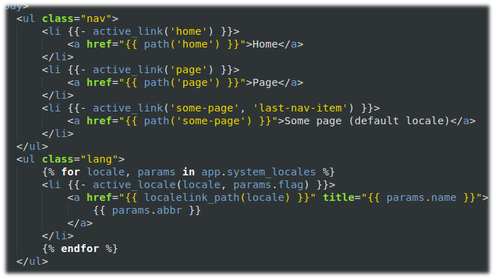
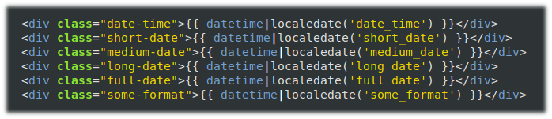

Silex-i18n
==========
[](https://travis-ci.org/simplesilex/silex-i18n)

Silex internationalization tools based on [Silex][1] micro-framework, [Symfony2][2] components and [Twig][3].

Silex-i18n works with PHP 5.3.3 or later.

## Features

* The **LinkServiceProvider** makes it easy to create locale links. [Learn more.](https://github.com/simplesilex/silex-i18n/blob/master/doc/links.md "LinkServiceProvider")


* The **DateServiceProvider** makes it easy to create custom date formats. [Learn more.](https://github.com/simplesilex/silex-i18n/blob/master/doc/dates.md "DateServiceProvider")


## Installation

The recommended way to install Silex-i18n is [through
composer](http://getcomposer.org). Just create a `composer.json` file and
run the `php composer.phar install` command to install it:
```json
{
    "require": {
        "simplesilex/silex-i18n": "0.2.*@dev"
    }
}
```


## Tests

To run the test suite, you need [composer](http://getcomposer.org).

    $ php composer.phar install --dev
    $ phpunit

## License

Silex-i18n is licensed under the MIT license.

[1]: http://silex.sensiolabs.org
[2]: http://symfony.com
[3]: http://twig.sensiolabs.org
